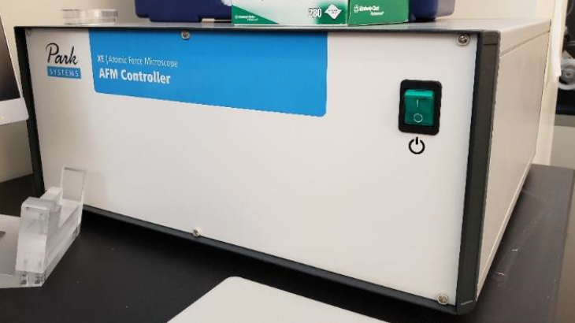
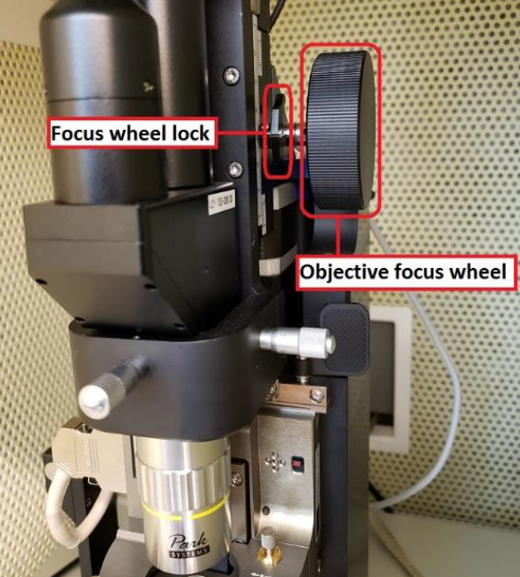
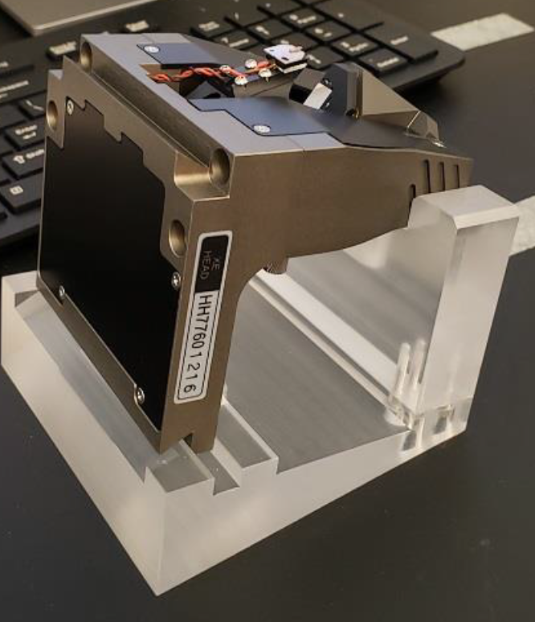

# Park AFM

## Warnings

- **Protect the optics by manually raising the objectives.** The computer control does not sense the objective position and could ram the z-stage into the objective.

- **Protect the lock mechanism of the focus.**

- **Before the AFM head is mounted or unmounted from the Z stage, the ON/OFF switch for the laser beam must be turned off. Otherwise, the laser beam diode in the AFM head may be damaged.**

- **When the AFM head is mounted or unmounted from the Z stage, ensure that the AFM head does not sustain any damage, and that it is properly grounded. The AFM head is extremely sensitive to electrostatic discharge.**

- **The superluminescent photodiode is 830nm, infrared, so invisible.** If you lose the photodiode position, it is difficult to find the spot, since the [wavelength is mostly infrared](https://parksystems.com/park-spm-modes/91-standard-imaging-mode/223-basic-contact-afm-dynamic-force-microscope-dfm). Adjust the x-y position of the photodiode only in small increments.

## System Start-Up

1. Carefully review all warnings attached to the side of the AFM box.
2. Sign-in to the logbook and read previous status.
3. Turn on the computer.
4. Turn on the Park XE AFM Controller. See image below.
v

## Sample Preparation

1. Use a magnetic sample holder disc and mount your sample to it using double-sided carbon tape.
   a. NOTE: You should touch your glove to the tape to reduce the stickiness of the surface allowing you to remove the sample without issue later.
2. Open the AFM isolation chamber and place the holder onto the sample stage.
   a. WARNING: The sample stage is magnetic. You should approach the stage with the holder from the side and slide it into place. Approaching from above the stage will cause the magnetic forces to “grab” the holder, crashing it into the surface, which can **cause damage to the piezo-electric xy stage**.
3. Turn on the Activation Table by pressing the power button on the right-side of the table. You should see the table front panel light up when it is on. See image below.
4. Set the Activation Table’s mode to ACTIVE by pressing the state button on the left-side of the table. The LED should change from “LOCK” to “ACT”. See image below.

## Engaging Sample

1. Launch the `Smart Scan` program and wait for the initialization process to finish.
2. Adjust the focus of the objective lens so it is focused on the cantilever. See image below.
   - To adjust the focus of the objective lens you must to hold the focus wheel and unlock it by moving the lever on the wheel back. It can be lowered by turning the wheel counter-clockwise.
     + **WARNING: ALWAYS unlock the focus wheel,** before moving it, and then hold the focus wheel when making adjustments as it will freely fall under the weight of the objective lens. Failing to unlock, may break the objective mechanism and hold the wheel as it will move under gravity.
     + You can determine when the cantilever is in focus by viewing the computer screen as you lower the objective.
   - Once the cantilever is in focus, lock the focus wheel by moving to lock lever toward you.
     + Do not over-tighten the lever but ensure it is a good position by making sure the objective maintains focus after it has been locked and you are no longer holding the wheel.
     + It is a common issue that the objective motional stage breaks, if not properly used.
     

3. **The photodiode is 830nm, so infrared and therefore invisible.** It is hard to locate the photodiode light beam, once you lose 
     
     
3. The photodiode beam can be seen in the software by looking at the cantilever. There will be a bright spot when the beam is on the cantilever. You can move the position of the beam by adjusting the dials on top of the z-stage. See image below.
  - The beam should be positioned near the tip of the cantilever. Adjust the position of the beam until the “Intensity (A+B)” reading is maximized (approx. 3 V)
4. The detector position is visualized in the software as a crosshair with a red/green dot with readings of the vertical/lateral position of the detector. It needs to be aligned so the dot in the crosshair is green. Adjust the position of the detector by adjusting the dials on the front of the z-stage. See image below.
   - By turning the dials on the front of the z-stage the dot on the crosshair will move left/right and up/down. Adjust the position of the detector until the “Vertical (A-B)” and “Lateral (C-D)” readings are minimized (less than 0.100 V is ideal)
   
   
   
   
   
5. In the “Smart Scan” software click on the “Auto” tab in the top-right. **Make sure that the green light for the centered diode beam is ON**, then select the “Position” icon on the left-side of the screen. (If the LED is red, you need to align the photodiode beam first.) This will begin the process of measuring the cantilever’s resonant frequency. The resonance frequency and Q-factor must be recorded in the logbook.
   - The AFM will then begin to approach the sample so the tip is engaged with the surface of the sample. Wait for this process to complete before proceeding. (It may take a minute or so.)
6. Once the auto-engage process is finished, adjust the focus of the objective so it is focused on the sample’s surface. The cantilever should be close to the surface now.
7. Close and lock the door so noise vibrations do not interfere with imaging.

## Non-Contact Mode Imaging

1. Ensure Non-Contact Mode `NCM` is set for the scan. This is done by selecting NCM from the Head mode list next to the “Setup” tab in the SmartScan software. See image below.

WARNING: If you need to move to a different area of your sample for a scan see the “Lift Procedure” section for instructions. Attempting to move the sample without following the lift procedure will break the cantilever.

2. You can capture an image by selecting the “Image” icon on the left-side of the screen.
3. Adjust the parameters for your scan as needed and determine an appropriate location for files to be saved once the scan is complete.
4. Once the scan is complete, you can redefine a new area by adjusting the scan window in the application or defining new scan area parameters.
   - NOTE: Your scan area should be a power of 2 and *must be square.*
   - Ex: 128 x 128, 256 x 256, 512 x 512, etc.
   - Scan areas “snap” to a grid defined by the software when moving them. You can make fine adjustments to the scan area window by using the “Offset” parameter.
5. You can use `Park XEI software` to analyze your images on Windows systems. [Gwyddion](http://gwyddion.net/) can be used for Mac OS systems.

## Lift Procedure

To move to a different area of your sample you need to “lift” the tip away from the surface sufficiently far enough above the surface so the cantilever easily clears the height of all features on your sample.

1. Defining the distance the tip should be raised and clicking the “Lift” button will disengage the tip from the sample’s surface. Lifting in intervals of 50 um is typically fine.
   + **CAUTION: The objective is very close to the z-stage during scanning.** Using a large value for the lift may cause the z-stage to crash into the objective lens, damaging it. A lift of 100 um is usually fine but make sure you are aware of your sample’s expected feature height to determine an appropriate lift height above the surface. If there is any doubt, it is best to first move the objective up by unlocking the focus wheel and turning it clockwise (away from you) to prevent the z-stage from crashing into the objective. Refocus on the sample once the lift is complete.
2. Moving the sample can be done by adjusting the dials on the sample stage. They will move the stage forward/back and left/right. See image below.

3. After repositioning your sample, click on the “Auto” tab and select the “Position” icon to re-engage the tip to the sample’s surface. This will perform a new scan of the cantilever to determine the resonant frequency and intensity which should be recorded in the logbook.
4. Scanning can be performed following instructions in the “Imaging the Sample” section above.

## Finishing Measurements

1. Unlock the objective (push lever back), then move the objective to the top position and lock back (pull forward). 
2. Perform a lift from the surface to disengage the tip. Typically a lift of 100 um is sufficient to clear all features.
3. Click the “End” icon on the left-side of the screen to automatically raise the z-stage away from the sample. A manual lift can be performed but it is best to select the “Lift z all” option to provide the largest clearance between the z-stage and sample, allowing for easier loading/unloading of samples.
4. Remove the sample holder from the sample stage by sliding it horizontally across the surface until it is no longer held by the magnet.
5. Return the Activation Table to the “Lock” state by pressing the button on the front left-side of the table, **wait until it is locked, will take about 30 seconds**, ONLY THEN turn it off by pressing the button on the front right-side. If the setup is used again, the next day, the activation table can be left on in the locked position.

## Cantilever Replacement

1. **IMPORTANT:** Turn OFF the photodiode. 

1. Ensure the objective is in its highest position.

2. Ensure all LEDs are off, ONLY THEN disconnect the cable on the left-side of the z-stage and move the paddles securing it to the instrument to the “in” position. The paddles are located at the top of the z-stage mounting rails. See image below.

3. The z-stage is heavy. Carefully slide the z-stage to the right, avoiding the objective, until it is off the mounting rails. See image above.
4. Place it in the stand as shown in the image below.

5. The cantilever can be removed by carefully lifting it up off of the two pins holding it in place. Place the removed cantilever in the appropriate slot of the replacements case.
6. Remove a new cantilever from the case, record the new cantilever’s ID in the log book, and attach it to the z-stage by aligning the pins to the cantilever’s slots. You will need to carefully attach it onto the z-stage until it softly clicks into place. See images below.
   + CAUTION: The cantilever is extremely delicate. Avoid getting the tip to touch any surface or anything.
   
   
   
   
7. Slide the z-stage back into its place on the instrument, careful to avoid hitting the objective.
   + Slide it all the way to the left, until it cannot be moved anymore.
8. Lock the z-stage in place by moving the paddles to the “out” position.
9. Connect the cable to the left side of the z-stage.
10. Focus on the cantilever tip and adjust laser according to previous section.

