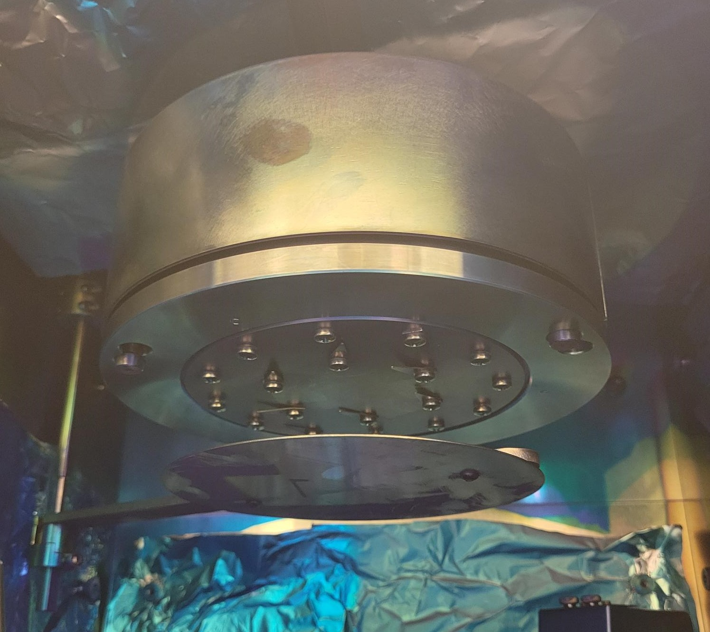
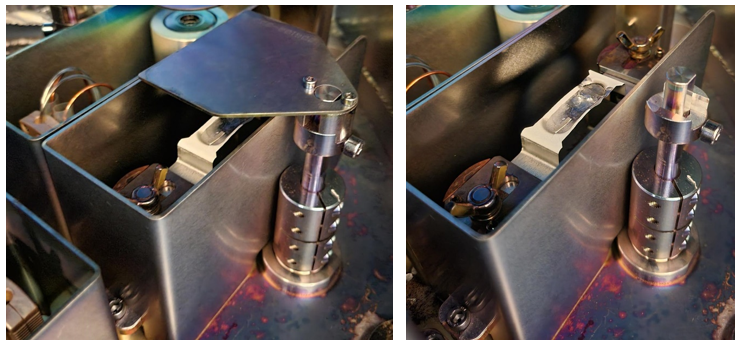

# Angstrom Thermal Evaporator (ATE)

## System Start Up

1.   Sign-in to the logbook and read previous status.

2.   Turn on the computer.

3.   Open the `AeresStartup` Software and log into the assigned user.

4.   If the deposition chamber pressure reads “Over Range (Torr)”, the deposition chamber is not pressurized and is able to be opened. If deposition chamber pressure reads any value, depressurize the chamber by selecting the “System” chiclet, selecting the “Vacuum System” tab and starting the “Vent” process as shown below.

## Sample Preparation

1.    Open the chamber door and rotate the sample plate holder clockwise until it locks into place. Rotate the sample plate shutter out of the way.

2.    Gently lift and spin the sample plate clockwise until it is freed from the screws. Lower and remove the sample plate from the chamber.

3.    Secure your sample substrates to the plate. Additional sample clips and screws can be found in the fume hood. **Ensure all holes in the sample plate are filled with screws before returning it to the deposition chamber.**

4.    Choose what type of source your material will be deposited from: **radak** (left) or **resistive boat** (right).

   
-  The radak sources have both power and temperature control.
    -   For the radak sources: lift and remove the deposition source shutter. Turn the luxel baffle counterclockwise and lift up to remove. Insert the 50-75% full radak into the tungsten heating coil.
    -    **CAUTION: The lip of the radak will poke out of the baffle opening** as shown in the image below. Replace the baffle by lining up the prongs and turning counterclockwise until the prongs drop into the track. Turn the baffle clockwise to tighten and replace the source shutter.
-   The resistive boat sources have only power control.
    -   For the resistive boat source, lift and remove the deposition source shutter. Loosen the wing nuts on each side and slide the resistive source under the side plates. Tighten the wingnuts to “finger-tight” so that the side plates are in contact with the resistive boat. **CAUTION: The boats are prone to cracking from overtightening of the wingnuts.**
    

    
5.  In the “Main” chiclet, navigate to the Load Materials tab. From the Side menu, select the source location where the deposition material has been placed and select the material from the drop-down menu. Click the Process tab and load the desired deposition recipe on the right drop-down menu. All recipe layers will populate the tab. 

## Material Deposition

1.  Turn on the chiller by pressing the “I/O” button on the front. The lights on the front panel will show if the water level is inadequate. Ensure that the pressure gauge on the front is below 60psi and the temperature is below 25C prior to starting the pump down sequence.

2.  Open the seal/vent compressed gas cylinder to 20psi output pressure. Open the pneumatic compressed gas cylinder to 80psi output pressure.

3. Check the roughing pump oil level is within the red bubble on the back panel.

4. If any variables in addition to the deposition rate, source temperature, power output, and % Rate deviation need to be live monitored, click to the “Data” chiclet, and open the “Real Time Data Viewer” tab on the left. Select and start data collection by selecting variables in the drop-down menu on the right.

5. If there is not a “Pump Down” step in the loaded recipe, go to the “System” chiclet, select the “Vacuum System” tab and start the Pump Down process. When the system is below the minimum required pressure for a deposition, the exterior light will turn green.

6. Once the Pump down process is completed, return to the Process tab in the “Main” chiclet and load the desired recipe. It will populate the recipe steps into the left bar under “Components”. Start the recipe by clicking the green “Play” button in the top right corner.
    -   During the deposition process, the deposition rate, source temperature, power output, and % Rate deviation are shown in the real time data viewer panel within Process tab in the “Main” chiclet.
    -    Deposition recipe variables can be changed during the process by selecting the recipe step in the left menu, entering the new variable value in the bottom window, and clicking “Update.” The variable values on the left should update to the entered value. This will not save the new values in the recipe file.
    -   If an error arises during the deposition process, the recipe can be stopped by clicking the red “Stop” button on the top right of the Process tab in the “Main” chiclet. If the system may be damaged by a step in the recipe, the emergency stop button on the right front of the evaporator can be used to cut power to all the system components.
    

7. Once the recipe is completed, navigate to the “System” chiclet, and select the Sources tab. The temperature of all sources in the system will be displayed. The evaporator system will not return to atmospheric pressure in the “Vent” process until all deposition sources are below 50C and the substrate heater is below 100C. 

## Sample Removal

1. Open the “System” chiclet, and select the Vacuum System tab. Click “Vent” and start the venting process. Once the process has the step “Venting Chamber” highlighted and the deposition chamber pressure reads “Over Range (Torr)”, the chamber door can be opened. The exterior light will be blue.

2. Turn the sample plate holder clockwise until it locks in place. Rotate the sample plate shutter away from the sample plate. Lift up and turn the sample plate clockwise to release it from the screws. Remove the sample plate from the chamber and take out the deposited samples. Replace all the screws in the holes in the sample plate prior to returning it to the deposition chamber. 

3. Lift up and remove the source shutter.
    -    For radak sources, turn the baffle counterclockwise and lift to remove. Remove and cover the radak and return to the appropriate desiccator. Replace the baffle lining up the prongs and turning counterclockwise until the prongs drop into the track. Turn the baffle clockwise to tighten and replace the source shutter.
    -   For resistive boat sources, loosen the wing nuts on each side of the source. Slide the resistive boat out of the holders. Cover and remove the boat and return it to the appropriate desiccator. Replace the source shutter.
    
4. Close the deposition chamber door.
    -    If the system is to be used for another deposition within 24 hours, go to the “Vacuum System” tab in “System” chiclet, and start the Pump Down process. Return to Step 4 in System Start-Up upon starting the next deposition.
    -   If the system is not going to be used in the next 24 hours, close both the pneumatic and seal/vent compressed gas cylinders. Turn off the chiller by pressing the “I/O” button on the front panel.
    
## Data Viewer in Aeres

-   All data can be loaded post-deposition in the “Data Viewer” tab in the “Data” chiclet. Click “Load File” in the upper right and select the deposition file in the file explorer.
-   Once the file loads, the “Filtered Parameters” can be chosen from the right menu and added to the graph by clicking “+” as shown in the image below.

## Recipe Builder

1.    If there is not a preexisting recipe for your deposition, navigate to the “Recipe” chiclet and open the “Process Builder” tab. Click New if starting a recipe from scratch. Click Open if editing an existing recipe or using an existing recipe as reference.
    -   Only one recipe can be opened at a time within the Process Builder tab.
    
2.	For recipes with a new material, it must first be added to the material database found in the “Materials” tab in the “Setup” chiclet.

3.	For the first deposition with a new material or a material in a new deposition source, an AutoTune step must be run prior to deposition to determine the PID parameters. 